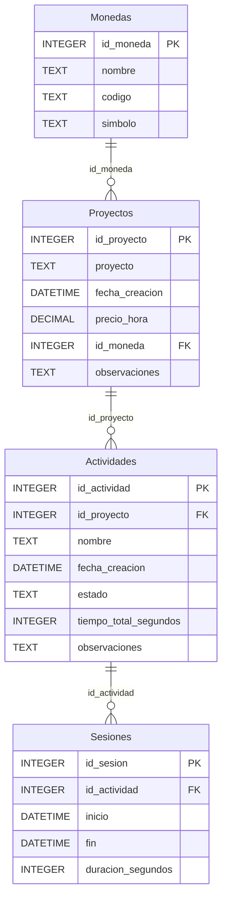

# Documentación de la base de datos — Programadores-ES-

Base de datos SQLite (vía `better-sqlite3`) usada por la app de escritorio Electron para llevar el control de proyectos, actividades y sesiones de trabajo (fichaje tipo cronómetro).

- **Motor:** SQLite 3
- **Driver:** `better-sqlite3` (síncrono)
- **Archivo:** `programadores_es.db`, ubicado junto al código (`path.join(__dirname, "programadores_es.db")`)
- **Módulo de acceso bajo nivel:** `db.js`
- **Módulo de acceso a datos (queries de negocio):** `repository.js`
- **Pragmas activados:**
  - `journal_mode = WAL` → escritura en modo *Write-Ahead Logging*, permite lecturas concurrentes mientras se escribe.
  - `foreign_keys = ON` → las claves foráneas se validan (SQLite las trae desactivadas por defecto).

El esquema se crea con `CREATE TABLE IF NOT EXISTS`, así que `initDatabase()` se puede llamar varias veces (p. ej. en cada arranque de la app o en cada test) sin destruir datos existentes ni fallar si las tablas ya existen.

---

## Diagrama entidad-relación



Jerarquía: **Moneda → Proyecto → Actividad → Sesión** (1:N en cada nivel).

---

## Tablas

### 1. `Monedas`

Catálogo de divisas para expresar el precio/hora de un proyecto.

| Columna   | Tipo    | Restricciones            | Descripción                          |
|-----------|---------|---------------------------|---------------------------------------|
| id_moneda | INTEGER | PK, AUTOINCREMENT         | Identificador único                   |
| nombre    | TEXT    | NOT NULL                  | Nombre de la moneda (ej. "Euro")      |
| codigo    | TEXT    | NOT NULL                  | Código ISO (ej. "EUR")                |
| simbolo   | TEXT    | opcional                  | Símbolo (ej. "€")                     |

Sin relación de dependencia hacia arriba; es tabla raíz del esquema.

---

### 2. `Proyectos`

Proyectos sobre los que se registran actividades y horas.

| Columna        | Tipo     | Restricciones                          | Descripción                                  |
|----------------|----------|------------------------------------------|-----------------------------------------------|
| id_proyecto    | INTEGER  | PK, AUTOINCREMENT                       | Identificador único                            |
| proyecto       | TEXT     | NOT NULL                                | Nombre del proyecto                            |
| fecha_creacion | DATETIME | DEFAULT CURRENT_TIMESTAMP               | Fecha/hora de alta                             |
| precio_hora    | DECIMAL(10,2) | opcional                           | Tarifa por hora                                |
| id_moneda      | INTEGER  | FK → `Monedas.id_moneda`                | Moneda del precio/hora                         |
| observaciones  | TEXT     | opcional                                | Notas libres                                   |

**Nota:** `id_moneda` no tiene `NOT NULL`, por lo que un proyecto puede existir sin moneda asociada (precio_hora quedaría sin unidad definida).

---

### 3. `Actividades`

Tareas/actividades dentro de un proyecto, con estado y tiempo acumulado.

| Columna               | Tipo     | Restricciones                                                                 | Descripción                              |
|------------------------|----------|--------------------------------------------------------------------------------|--------------------------------------------|
| id_actividad           | INTEGER  | PK, AUTOINCREMENT                                                              | Identificador único                        |
| id_proyecto            | INTEGER  | NOT NULL, FK → `Proyectos.id_proyecto`                                         | Proyecto al que pertenece                  |
| nombre                 | TEXT     | NOT NULL                                                                       | Nombre de la actividad                     |
| fecha_creacion         | DATETIME | DEFAULT CURRENT_TIMESTAMP                                                      | Fecha/hora de alta                         |
| estado                 | TEXT     | CHECK IN ('Pendiente','En progreso','Pausada','Finalizada'), DEFAULT 'Pendiente' | Estado actual de la actividad              |
| tiempo_total_segundos  | INTEGER  | DEFAULT 0                                                                      | Suma acumulada de todas sus sesiones       |
| observaciones          | TEXT     | opcional                                                                       | Notas libres                               |

`tiempo_total_segundos` es un campo **desnormalizado**: se recalcula/actualiza cada vez que se pausa o finaliza una sesión, en vez de sumar `Sesiones.duracion_segundos` al vuelo en cada lectura. Esto evita recalcular con JOIN+SUM en cada consulta de listado, a cambio de tener que mantenerlo sincronizado manualmente (lo hace `repository.js`).

---

### 4. `Sesiones`

Registro de cada intervalo de trabajo (cronómetro) sobre una actividad.

| Columna            | Tipo     | Restricciones                              | Descripción                                          |
|---------------------|----------|----------------------------------------------|--------------------------------------------------------|
| id_sesion           | INTEGER  | PK, AUTOINCREMENT                           | Identificador único                                    |
| id_actividad        | INTEGER  | NOT NULL, FK → `Actividades.id_actividad`   | Actividad a la que pertenece                           |
| inicio              | DATETIME | NOT NULL                                    | Marca de inicio (`datetime('now','localtime')`)        |
| fin                 | DATETIME | NULL mientras la sesión está abierta        | Marca de fin                                           |
| duracion_segundos   | INTEGER  | NULL mientras la sesión está abierta        | Duración calculada al cerrar la sesión                 |

Una sesión con `fin = NULL` se considera **sesión abierta** (cronómetro corriendo). Solo puede haber una sesión abierta por actividad a la vez (se valida en `iniciarSesion`).

---

## Relaciones (resumen de claves foráneas)

| Tabla       | Columna FK   | Referencia            |
|-------------|--------------|------------------------|
| Proyectos   | id_moneda    | Monedas.id_moneda       |
| Actividades | id_proyecto  | Proyectos.id_proyecto   |
| Sesiones    | id_actividad | Actividades.id_actividad|

`foreign_keys = ON` está activado explícitamente en `initDatabase()`, así que SQLite rechaza inserts con FK inexistente (`FOREIGN KEY constraint failed`) y lo verifican los tests en `test/db.test.js`. **No hay `ON DELETE CASCADE`**: borrar una fila con hijos dependientes (p. ej. un proyecto con actividades) fallará por violación de FK en vez de arrastrar el borrado. Si se quiere borrado en cascada habría que añadirlo explícitamente en el `CREATE TABLE` (`ON DELETE CASCADE`) o borrar los hijos manualmente antes desde `repository.js`.

---

## Ciclo de vida de una Actividad / Sesión

```
Pendiente ──(iniciarSesion)──► En progreso ──(pausarSesion)──► Pausada
                                     ▲                              │
                                     └──────(reanudarSesion)────────┘
                                     │
                                     └──(finalizarActividad, en cualquier momento)──► Finalizada
```

- **`iniciarSesion(id_actividad)`**: dentro de una transacción, comprueba que no haya ya una sesión abierta, inserta una fila en `Sesiones` con `inicio = now` y `fin = NULL`, y pone la actividad en `'En progreso'`.
- **`pausarSesion(id_actividad)`**: cierra la sesión abierta (`fin = now`), calcula `duracion_segundos` con `julianday(fin) - julianday(inicio)`, y **suma** esa duración a `Actividades.tiempo_total_segundos`. Pone la actividad en `'Pausada'`.
- **`reanudarSesion(id_actividad)`**: es un alias de `iniciarSesion` (abre una sesión nueva e independiente). Existe como nombre propio solo para reflejar la intención desde la UI.
- **`finalizarActividad(id_actividad)`**: si hay una sesión abierta la cierra primero (llamando a `pausarSesion`), luego recalcula `tiempo_total_segundos` como `SUM(duracion_segundos)` de **todas** las sesiones de esa actividad (en vez de fiarse del acumulado incremental) y marca la actividad como `'Finalizada'`. Esto actúa como una re-sincronización defensiva del campo desnormalizado.

Todas las operaciones que tocan más de una tabla (`iniciarSesion`, `pausarSesion`, `finalizarActividad`) se ejecutan dentro de `db.transaction(...)` para garantizar atomicidad.

---

## Capa de acceso a datos (`repository.js`)

Funciones expuestas, agrupadas por entidad:

**Monedas**
- `crearMoneda({ nombre, codigo, simbolo })`
- `listarMonedas()` — ordenadas por `nombre`
- `eliminarMoneda(id_moneda)`

**Proyectos**
- `crearProyecto({ proyecto, precio_hora, id_moneda, observaciones })`
- `listarProyectos()` — con `LEFT JOIN Monedas` para traer `moneda_codigo` y `moneda_simbolo`, ordenados por `fecha_creacion DESC`
- `obtenerProyecto(id_proyecto)` — mismo JOIN, un solo registro
- `actualizarProyecto(id_proyecto, campos)` — solo permite actualizar `proyecto`, `precio_hora`, `id_moneda`, `observaciones` (whitelist)
- `eliminarProyecto(id_proyecto)`

**Actividades**
- `crearActividad({ id_proyecto, nombre, observaciones })`
- `listarActividades(id_proyecto?)` — todas o filtradas por proyecto
- `obtenerActividad(id_actividad)`
- `actualizarActividad(id_actividad, campos)` — whitelist: `nombre`, `estado`, `observaciones`
- `eliminarActividad(id_actividad)`

**Sesiones**
- `sesionAbierta(id_actividad)` — devuelve la sesión con `fin IS NULL`, o `undefined`
- `iniciarSesion(id_actividad)`
- `pausarSesion(id_actividad)`
- `reanudarSesion(id_actividad)`
- `finalizarActividad(id_actividad)`
- `listarSesiones(id_actividad)` — ordenadas por `id_sesion`

Patrón común en `actualizarProyecto` / `actualizarActividad`: construyen el `SET` dinámicamente solo con las claves permitidas presentes en `campos`, evitando así SQL injection vía nombre de columna (whitelist) y updates parciales sin tocar columnas no enviadas.

---

## Módulo `db.js`

- `initDatabase()`: abre/crea el archivo `.db`, activa pragmas, ejecuta el DDL (`CREATE TABLE IF NOT EXISTS` para las 4 tablas) y devuelve la instancia.
- `getDb()`: devuelve la instancia ya inicializada; lanza error si se llama antes de `initDatabase()`.
- `closeDatabase()`: cierra la conexión y limpia la referencia en memoria (usado sobre todo en tests, para poder borrar el directorio temporal después).

---

## Tests (`test/db.test.js`)

Usan `fs.mkdtempSync()` para crear un directorio temporal único por test (aislamiento total, sin residuos entre ejecuciones) y mockean `electron.app.getPath` para apuntar la DB ahí. Cobertura actual:

- Creación de las 4 tablas.
- `foreign_keys` activado.
- Llamar `initDatabase()` dos veces no borra datos (idempotencia del `CREATE TABLE IF NOT EXISTS`).
- Relación Proyecto↔Moneda vía JOIN.
- Rechazo de FK inexistente en `Actividades` (proyecto huérfano).
- Rechazo del `CHECK` de `estado` con un valor no permitido.
- Valores por defecto de una actividad nueva (`Pendiente`, `tiempo_total_segundos = 0`).
- Lógica completa de sesiones: abrir con `fin NULL`, cálculo de `duracion_segundos` al pausar, independencia entre sesiones al reanudar, suma correcta de tiempo total al finalizar, y rechazo de FK inexistente en `Sesiones`.

---

## Puntos a tener en cuenta / posibles mejoras futuras

- **Sin `ON DELETE CASCADE`**: borrar un proyecto con actividades (o una actividad con sesiones) falla por FK en vez de arrastrar el borrado. Si se quiere permitir, añadir `ON DELETE CASCADE` en las FKs del `CREATE TABLE` o gestionar el borrado en cascada manualmente en `repository.js`.
- **`tiempo_total_segundos` desnormalizado**: se mantiene sincronizado a mano en `pausarSesion` (suma incremental) y `finalizarActividad` (recalculado desde cero). Si en el futuro se edita o borra una sesión manualmente sin pasar por estas funciones, ese campo puede quedar desincronizado.
- **Sin índices explícitos** más allá de las claves primarias (que SQLite indexa automáticamente). Si el volumen de datos crece mucho, valdría la pena añadir índices sobre `Actividades.id_proyecto` y `Sesiones.id_actividad` para acelerar los listados filtrados y los JOIN, aunque con SQLite y volúmenes de uso personal probablemente no sea necesario a corto plazo.
- **`id_moneda` opcional en `Proyectos`**: permite proyectos "huérfanos" de moneda; si se quiere forzar siempre una moneda, cambiar a `NOT NULL` (rompería compatibilidad con datos existentes sin migración).